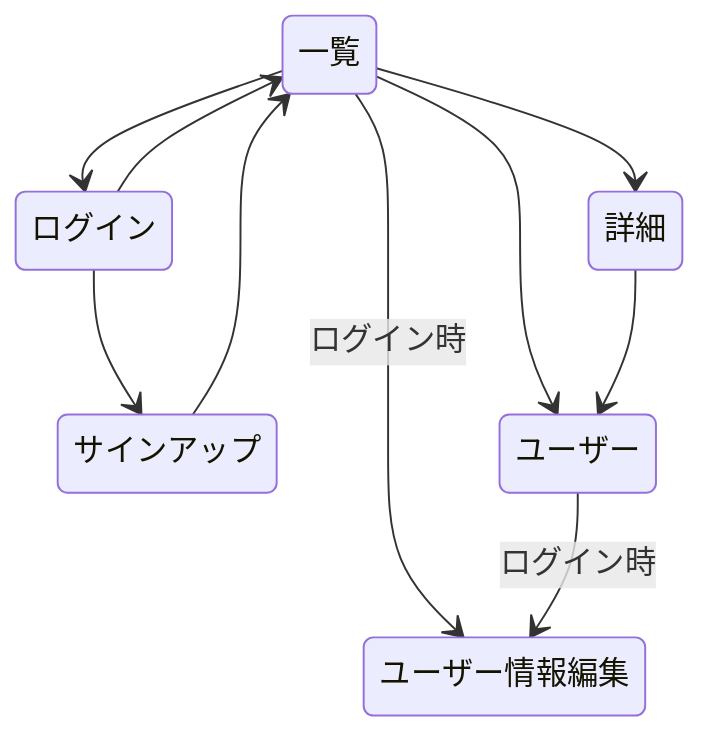

# ログイン画面
* emailとpasswordのフォーム
* サインアップに遷移できるボタンを作成 

# サインアップ画面
* emailとpasswordと確認passwordのフォーム

# イラストの一覧画面
* 登録されているイラストの一覧を表示する
* 上部に検索バー作成

# イラストの詳細画面 
* イラストの詳細を表示する
* ユーザーアイコンからユーザー詳細画面に遷移する

# ユーザーの詳細画面
* ユーザー情報を表示
* フォローフォロワーの一覧

# ユーザー情報の編集画面
* ユーザー情報の編集する画面
* ログインユーザーのみ編集可能
